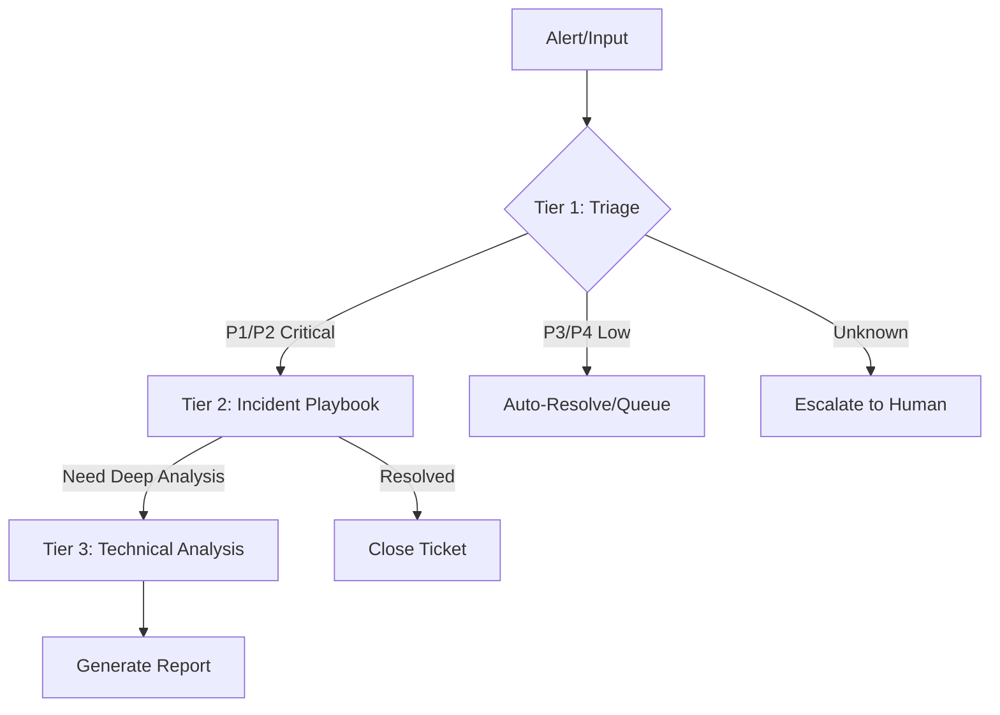

# LLM Architecture Guide 2025

> **Hướng dẫn lựa chọn và tối ưu hóa AI Model cho Vietnamese-Banking-Cyber-Skills**
>
> *Cập nhật: Tháng 4/2025*

---

## 📚 AI/LLM Terminology Guide

*Giải thích ngắn gọn các thuật ngữ AI thường gặp*

### 🧠 Model Parameters

| Thuật ngữ | Giải thích | Ví dụ |
|-----------|------------|-------|
| **Context Window** | Số tokens tối đa AI có thể "nhớ" trong một cuộc hội thoại | Claude 3.5: 200K tokens ≈ 150.000 từ tiếng Việt |
| **Max Output Tokens** | Số tokens tối đa AI có thể tạo ra trong một lần trả lời | Thường 4K-8K tokens |
| **Temperature** | Độ "sáng tạo" của câu trả lời (0-1) | 0 = chính xác, 1 = sáng tạo |
| **Top-p / Top-k** | Kiểm soát độ đa dạng của câu trả lời | Top-p 0.9 = chọn từ trong top 90% xác suất |

### 🔤 Token là gì?

> **Token** là đơn vị cơ bản AI dùng để xử lý văn bản

| Ngôn ngữ | Ví dụ | Số tokens |
|----------|-------|-----------|
| Tiếng Anh | "Hello world" | ~2 tokens |
| Tiếng Việt | "Xin chào" | ~3-4 tokens |
| Code | `print("hello")` | ~4 tokens |

**Quy tắc ước tính:**
- Tiếng Anh: ~0.75 từ/token
- Tiếng Việt: ~0.5-0.7 từ/token (dấu tiếng Việt tốn thêm tokens)

### 🛠️ AI Agent Concepts

| Thuật ngữ | Giải thích |
|-----------|------------|
| **System Prompt** | Hướng dẫn "tính cách" và nhiệm vụ của AI Agent |
| **Skill** | Module chuyên biệt để thực hiện một tác vụ cụ thể |
| **Tool Calling** | AI gọi hàm/tool bên ngoài (đọc file, chạy lệnh...) |
| **RAG** | Retrieval-Augmented Generation - AI tra cứu tài liệu rồi trả lời |
| **Few-shot** | Đưa AI xem vài ví dụ trước khi yêu cầu làm việc tương tự |
| **Chain-of-Thought** | Yêu cầu AI "suy nghĩ" từng bước trước khi trả lời |

### 📊 Performance Metrics

| Thuật ngữ | Ý nghĩa |
|-----------|---------|
| **Latency** | Thời gian phản hồi (ms) |
| **Throughput** | Số request xử lý/giây |
| **Hallucination** | AI "bịa" thông tin không có thật |
| **Prompt Injection** | Tấn công điều khiển AI bằng input độc hại |

---

## 📋 Tổng quan

Tài liệu này cung cấp khuyến nghị chi tiết về việc lựa chọn AI model, Context Window Size, và Max Output Token cho từng tier của skill trong hệ thống Vietnamese-Banking-Cyber-Skills.

**Mục tiêu:**
- Tối ưu chi phí (Cost Optimization)
- Đảm bảo tốc độ phản hồi (Latency)
- Duy trì độ chính xác (Accuracy)

---

## 📊 Bảng khuyến nghị tiêu chuẩn

| Đặc tả kỹ thuật | Tier 1: Master Playbook | Tier 2: Incident Playbook | Tier 3: Technical Deep Analysis |
| :--- | :--- | :--- | :--- |
| **Vai trò chính** | Triage, phân loại, routing nhanh | Quy trình đa nhánh, đối chiếu rule/config | Phân tích chuyên sâu, log lớn, suy luận phức tạp |
| **Model đề xuất** | `Claude 4 Haiku`<br>`GPT-4.1-nano`<br>`Gemini 2.5 Flash`<br>`DeepSeek-V3` | `Claude 4 Sonnet`<br>`GPT-4.1`<br>`Gemini 2.5 Pro`<br>`DeepSeek-R1` | `Claude 4 Opus`<br>`GPT-4.5`<br>`Gemini 2.5 Pro`<br>`o3 / o4-mini` |
| **Context Window tối thiểu** | 128K tokens | 256K tokens | 1M tokens |
| **Context Window khuyến nghị** | 200K tokens | 1M tokens | **2M+ tokens** |
| **Max Output Tokens** | 4K tokens | 8K tokens | 16K+ tokens |
| **Chi phí** | Rẻ (~$0.10 / $0.40 per 1M) | TB (~$2.0 / $8.0 per 1M) | Cao (~$5.0+ / $15+ per 1M) |

---

## 🔍 Phân tích chi tiết theo Tier

### Tier 1 - Master Playbook (Triage & Route)

**Đặc điểm:**
- Logic đơn giản, tuần tự
- Xử lý nhanh, chi phí thấp
- Đọc file nhỏ đến trung bình (<10KB)

**Model khuyến nghị:**

| Model | Ưu điểm | Nhược điểm | Use case |
|-------|---------|------------|----------|
| **Claude 4 Haiku** | Nhanh, rẻ, instruction-following tốt | Suy luận phức tạp hạn chế | Phân loại alert, tick checklist |
| **GPT-4.1-nano** | Tốc độ cực nhanh, giá rẻ nhất OpenAI | Context nhỏ hơn | Routing cơ bản |
| **Gemini 2.5 Flash** | Context 1M tokens, giá rẻ | Chất lượng suy luận TB | Đọc nhiều file nhỏ |
| **DeepSeek-V3** | Open source, chi phí thấp nhất | Cần self-host hoặc API TQ | Triage nội bộ |

**Chiến lược triển khai:**
```yaml
# Tier 1 Configuration
model: "claude-4-haiku-20241022"
max_tokens: 4096
temperature: 0.1  # Low for deterministic routing
timeout: 5000ms   # 5 seconds max
```

**Ví dụ skills:**
- `playbook-master-incident-triage`
- `classify-alert-severity`
- `route-to-appropriate-playbook`

---

### Tier 2 - Incident Playbook (Logic & Branching)

**Đặc điểm:**
- Nhiều nhánh logic
- Đọc đa file (config, dictionary, SOPs)
- Đối chiếu với quy định compliance

**Model khuyến nghị:**

| Model | Ưu điểm | Nhược điểm | Use case |
|-------|---------|------------|----------|
| **Claude 4 Sonnet** | Cân bằng speed/reasoning tốt nhất | Giá cao hơn Haiku | Playbook phức tạp |
| **GPT-4.1** | Cải tiến lớn vs GPT-4o | Context < Gemini | Đa file reference |
| **Gemini 2.5 Pro** | Context 2M, multimodal | Đôi khi "overthink" | Compliance analysis |
| **DeepSeek-R1** | Reasoning tốt, rẻ | Cần verify output | Suy luận nhiều bước |

**Chiến lược triển khai:**
```yaml
# Tier 2 Configuration
model: "claude-4-sonnet-20241022"
max_tokens: 8192
temperature: 0.2
prompt_caching: enabled  # Cache compliance docs
chain_of_thought: required
```

**Ví dụ skills:**
- `playbook-phishing-response`
- `playbook-data-leak-response`
- `playbook-abnormal-user-behavior-response`

**Lưu ý quan trọng:**
- Sử dụng **Prompt Caching** cho các file tĩnh (Nghị định 356, Luật ANM)
- Yêu cầu **Chain-of-Thought** trước khi quyết định nhánh
- Cache hit giảm 50-90% chi phí

---

### Tier 3 - Technical Deep Analysis (Heavy Data)

**Đặc điểm:**
- Phân tích chuyên sâu
- File lớn (log, dump, pcap)
- Suy luận logic phức tạp

**Model khuyến nghị:**

| Model | Ưu điểm | Nhược điểm | Use case |
|-------|---------|------------|----------|
| **Claude 4 Opus** | Suy luận phức tạp nhất | Đắt nhất | Code analysis, reverse engineering |
| **GPT-4.5** | OpenAI flagship | Context hạn chế | Complex reasoning |
| **Gemini 2.5 Pro** | Context 2M+ tokens | Latency cao | Log khổng lồ, multimodal |
| **o3 / o4-mini** | Suy luận sâu | Chậm, đắt | Problem-solving phức tạp |

**Chiến lược triển khai:**
```yaml
# Tier 3 Configuration
model: "gemini-2.5-pro-preview-03-25"
max_tokens: 16384
temperature: 0.3
context_window: 2097152  # 2M tokens
preprocessing: required  # Must pre-process binary files
```

**Ví dụ skills:**
- `conducting-memory-forensics-with-volatility`
- `analyzing-ueba-alerts-varonis`
- `analyzing-dlp-alerts`
- `analyzing-azure-ad-signin-logs`

---

## 🚨 Xử lý file đặc biệt (KHÔNG ĐƯA RAW VÀO LLM)

| File Type | Kích thước | Không làm | Làm thế nào | Tool đề xuất |
|-----------|------------|-----------|-------------|--------------|
| **Memory Dump** (.mem, .raw) | 1-32GB | Đưa binary vào LLM | Volatility → JSON/TXT | Volatility 3, MemProcFS |
| **PCAP** (.pcap, .pcapng) | 100MB-10GB | Đưa binary vào LLM | tshark/Zeek → CSV/JSON | Wireshark, Zeek |
| **Log files** (>1M dòng) | 100MB+ | Nhồi vào context | Python filter → RAG | Pandas, ChromaDB |
| **Binary** (.exe, .dll) | 1-100MB | Đưa binary vào LLM | Strings/Hex → TXT | IDA Pro, Ghidra |
| **Disk Image** (.e01, .dd) | 10GB-1TB | Đưa raw vào LLM | SleuthKit → Timeline | Autopsy, Plaso |

**Workflow chuẩn:**
```
Raw File → Pre-processing Tool → Structured Data (JSON/CSV/TXT) → LLM Analysis
```

---

## 💡 Tối ưu hóa chi phí & hiệu suất

### 1. Waterfall Routing Architecture



**Chi phí trung bình mỗi incident:**
- Tier 1 only: ~$0.001-0.005
- Tier 1 → Tier 2: ~$0.05-0.20
- Full pipeline: ~$0.50-2.00

### 2. Prompt Caching Strategy

**Những gì nên cache:**
- System prompts (cybersecurity-skills-mode)
- Compliance documents (Nghị định 356, Luật ANM)
- SOPs và playbooks
- MITRE ATT&CK mappings

**Provider hỗ trợ:**
| Provider | Cache Discount | TTL |
|----------|----------------|-----|
| Anthropic | 90% | 5 min |
| Google | 50% | 1 hour |
| OpenAI | 50% | 1 hour |

### 3. Hybrid Architecture (On-premise + Cloud)

```yaml
# Tier 1: Local LLM (Data sensitive)
tier_1:
  model: "llama-3.3-70b"  # Self-hosted
  endpoint: "http://internal-llm:8000"
  use_for: ["triage", "routing", "classification"]

# Tier 2-3: Cloud API (High reasoning)
tier_2_3:
  model: "claude-4-sonnet"
  endpoint: "https://api.anthropic.com"
  use_for: ["incident_response", "deep_analysis"]
```

### 4. Batch Processing

**Gom nhiều alert nhỏ:**
```python
# Instead of 10 API calls for 10 alerts
# Batch into 1 call
batch_input = {
    "alerts": [alert1, alert2, ..., alert10],
    "instruction": "Phân loại và nhóm các alert liên quan"
}
# Cost: 1 call instead of 10
# Savings: ~90%
```

---

## 🔧 Configuration Examples

### Roo Code Settings

```json
{
  "modes": {
    "cybersecurity-skills-mode": {
      "tier_1": {
        "model": "claude-4-haiku-20241022",
        "max_tokens": 4096,
        "temperature": 0.1
      },
      "tier_2": {
        "model": "claude-4-sonnet-20241022",
        "max_tokens": 8192,
        "temperature": 0.2,
        "prompt_caching": true
      },
      "tier_3": {
        "model": "gemini-2.5-pro-preview-03-25",
        "max_tokens": 16384,
        "temperature": 0.3,
        "context_window": 2097152
      }
    }
  }
}
```

### Environment Variables

```bash
# Tier 1 - Fast & Cheap
export TIER1_MODEL="claude-4-haiku-20241022"
export TIER1_MAX_TOKENS=4096

# Tier 2 - Balanced
export TIER2_MODEL="claude-4-sonnet-20241022"
export TIER2_MAX_TOKENS=8192
export TIER2_CACHE_ENABLED=true

# Tier 3 - Powerful
export TIER3_MODEL="gemini-2.5-pro-preview-03-25"
export TIER3_MAX_TOKENS=16384
export TIER3_CONTEXT_WINDOW=2097152
```

---

## 📈 Monitoring & Metrics

**Các chỉ số cần theo dõi:**

| Metric | Tier 1 | Tier 2 | Tier 3 |
|--------|--------|--------|--------|
| Latency (p95) | <500ms | <3s | <30s |
| Cost per call | <$0.01 | <$0.50 | <$5.00 |
| Success rate | >99% | >95% | >90% |
| Cache hit rate | N/A | >70% | >50% |

**Tools monitoring:**
- LangSmith (LangChain)
- OpenLLMetry
- Custom dashboard với Prometheus/Grafana

---

## 🔄 Cập nhật & Bảo trì

**Lịch review:**
- **Hàng tháng:** Kiểm tra giá model mới
- **Hàng quý:** Đánh giá performance metrics
- **Hàng năm:** Review và cập nhật model recommendations

**Nguồn cập nhật:**
- [Anthropic Model Updates](https://www.anthropic.com/news)
- [OpenAI Model Updates](https://openai.com/blog)
- [Google AI Updates](https://ai.googleblog.com)
- [DeepSeek Updates](https://www.deepseek.com)

---

## 📚 Tham khảo

- [Anthropic Claude Documentation](https://docs.anthropic.com)
- [OpenAI API Documentation](https://platform.openai.com/docs)
- [Google Gemini Documentation](https://ai.google.dev/gemini-api)
- [DeepSeek API Documentation](https://platform.deepseek.com)
- [agentskills.io Standard](https://agentskills.io)

---

*Last updated: April 2025*
*Maintained by: Vietnamese Banking Cyber Skills Team*